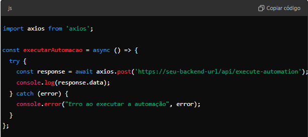
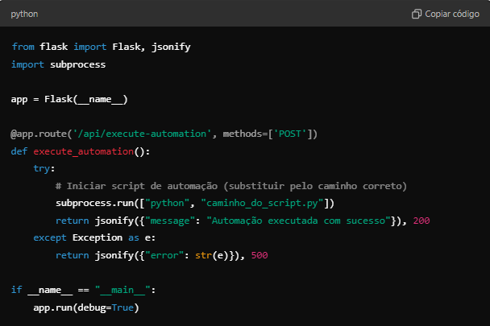
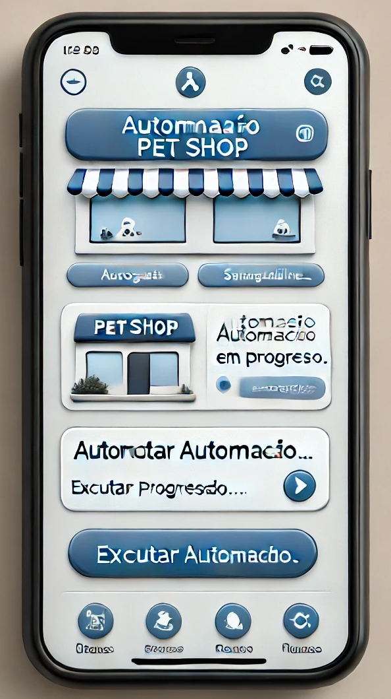

## Automatizando Processos utilizando Framework React-Native.

### **Descrição do processo e trabalho feito:**

Todos os dias há uma grande demora na execução da criação da planilha do excel e atrasos no envio por email, onde nela contém diversas informações e são consolidadas em formas de relatórios extremamente importante para área de negócio. São geradas através de Macros VBA e entregues ao gestor.

O problema inicial é que mesmo tendo muitos códigos para gerar esta planilha automática e enviar para o gestor, há um tempo considerável processando tudo e deve ser feita diáriamente, entregue para o gestor no primeiro horário, resultando em uma pessoa ter que chegar mais cedo, todos os dias de 12 á 20 minutos e executar/rodar as macros e enviar para o gestor, se tudo der certo.

De forma a resolver o problema primeiro até conseguir passar todos os dados para uma ferramenta mais robusta ideal como o Tableau e Power bi, foi desenvolvido este código para atender a necessidade do gestor e evitar que tenha hora extra.

Há códigos em VBA na planilha usada como objeto principal, onde faz diversos processos de atualizações, como puxar dados de outras planilhas e portal CRM via navegador web, portanto neste script não haverá detalhamento desta parte. Somente a execução da macro vba 'click' usando python e envio por email para o gestor.

Transformando esse processo de automação em um aplicativo mobile utilizando React Native, precisei seguir algumas etapas, uma vez que React Native é uma ferramenta voltada para o desenvolvimento de aplicativos móveis e não pode executar scripts diretamente no sistema operacional como o Python faz. No entanto, pude adaptar o processo para que seja acessível via um aplicativo móvel, enquanto o backend pode continuar a executar o script de automação.

#### Aqui está o processo detalhado e o trabalho feito: 

#### 1. Dividir o projeto em frontend e backend

**Frontend:** O aplicativo React Native será responsável pela interface gráfica (UI) e pelas interações do usuário. Ele permitirá ao usuário iniciar manualmente o processo, verificar o status e visualizar o envio do e-mail.

**Backend:** Será necessário desenvolver um backend (API) para realizar a automação. O script Python que executa as macros e envia os e-mails será movido para o backend.

#### 2. Escolher a estrutura de backend

**Flask ou Django (Python):** Como já está utilizando Python, Flask ou Django são ótimas opções para o backend. Você pode usar Flask para criar uma API REST que será consumida pelo aplicativo React Native. Esta API será responsável por iniciar o processo de automação.

**O backend será responsável por:**

- Executar a macro.
- Aguardar a finalização do processo.
- Enviar a planilha por e-mail.
- Retornar o status da operação para o aplicativo React Native.

#### 3. Interface do usuário (UI) com React Native

No React Native, você criará uma interface simples para o usuário interagir:

**Botão** "Executar Automação": Quando clicado, o botão enviará uma requisição à API para iniciar o processo.

**Tela de progresso:** Enquanto o processo está sendo executado, a tela pode mostrar o status, como "Executando macro", "Aguardando envio", etc.

**Notificação de conclusão:** Quando o envio for concluído, o aplicativo poderá exibir uma notificação ou mensagem de sucesso.

#### 4. Implementar a comunicação com a API

**No React Native, você utilizará bibliotecas como Axios ou Fetch para enviar requisições HTTP para a API do backend.**

**Chamada na API usando JavaScript:**

#### 5. Configurar o backend

**O backend deve:**

**Receber a requisição do aplicativo:** Um endpoint REST pode ser configurado para iniciar o processo de automação.

#### 6. Implementar notificações push (opcional)

Para que o gestor seja notificado no celular quando o processo for concluído, você pode integrar serviços de notificações push, como Firebase Cloud Messaging (FCM).

#### 7. Teste e deploy

**Testes locais:** Verifique se a comunicação entre o aplicativo React Native e o backend está funcionando corretamente.

**Deploy do backend:** O backend pode ser hospedado em um servidor na nuvem, como AWS, Heroku ou DigitalOcean.

**Publicação do app:** O aplicativo pode ser publicado na App Store e Google Play para que os usuários possam instalá-lo.

#### 8. Aplicativo pronto (Simulação)

Simulação de como o aplicativo ficaria exibido em um celular, com uma interface simples e o botão "Executar Automação" ao centro, além da área de status de execução logo abaixo.

#### Resumo do trabalho realizado:

- **Problema inicial:** Execução demorada de macros e envio manual de e-mails.

- **Solução proposta:** Automação da execução via script Python.

- **Transformação para aplicativo:**

1. Separação em frontend (React Native) e backend (API em Python).

2. O frontend oferece uma interface simples para controle da automação.

3. O backend executa o script Python e se comunica com o aplicativo.

2. Implementação de notificações e feedback de execução no aplicativo.

Com isso, a automação pode ser iniciada e monitorada facilmente pelo celular, sem a necessidade de estar fisicamente 
presente para rodar o script.
